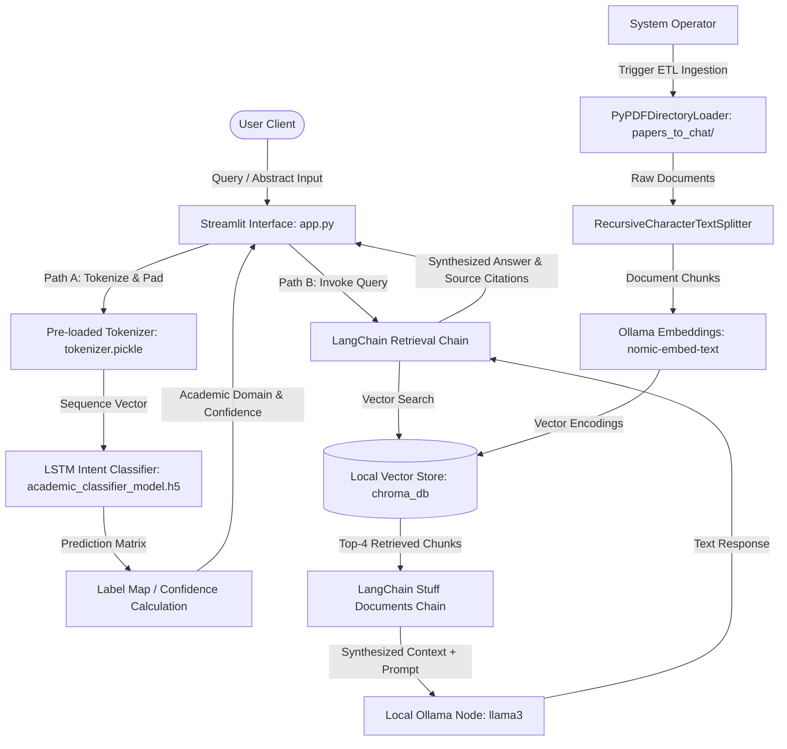
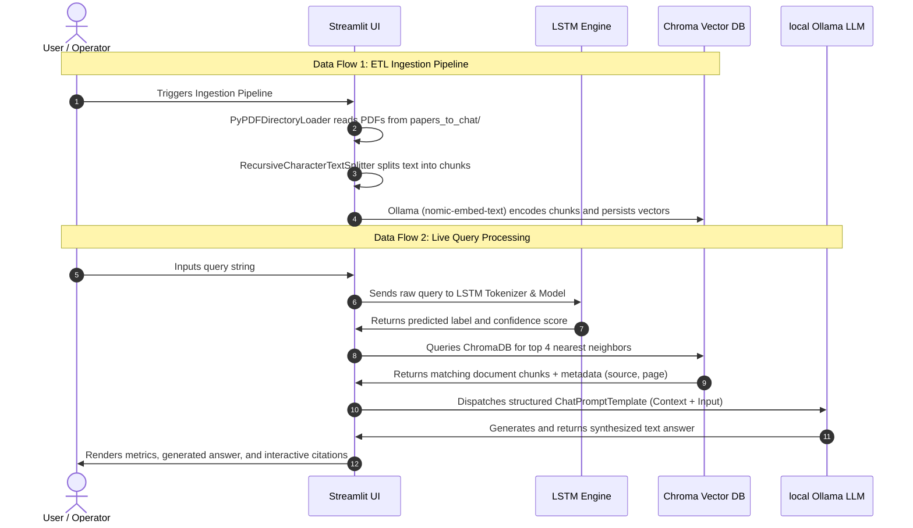
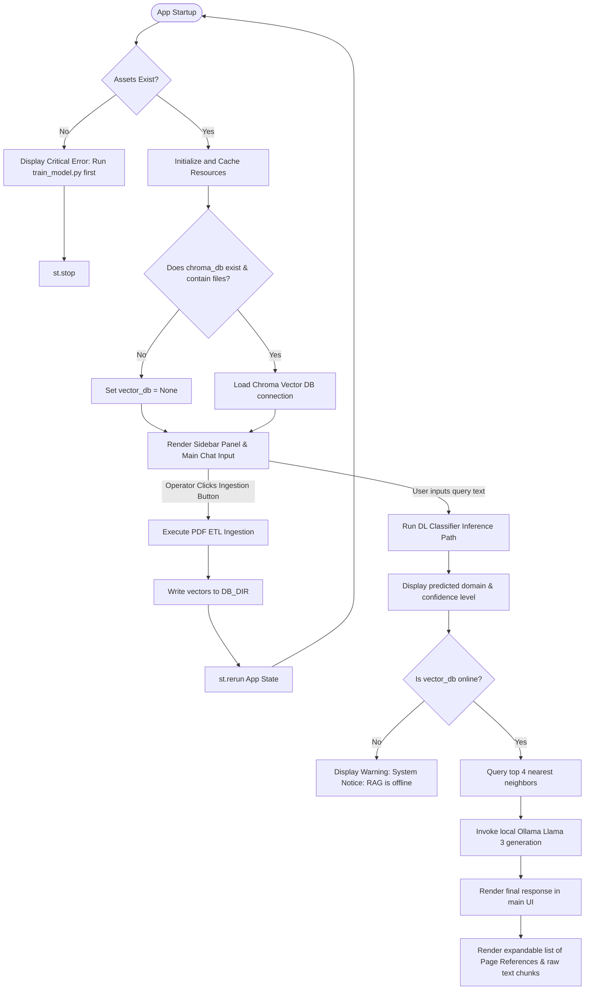
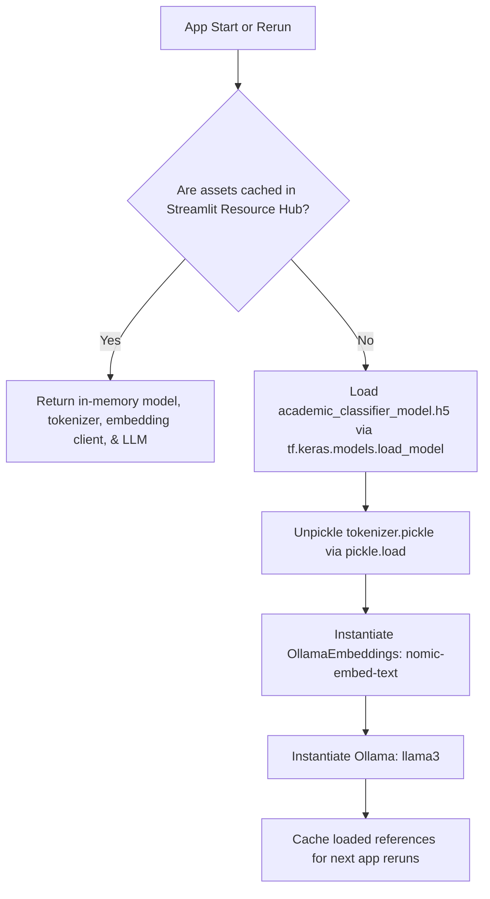
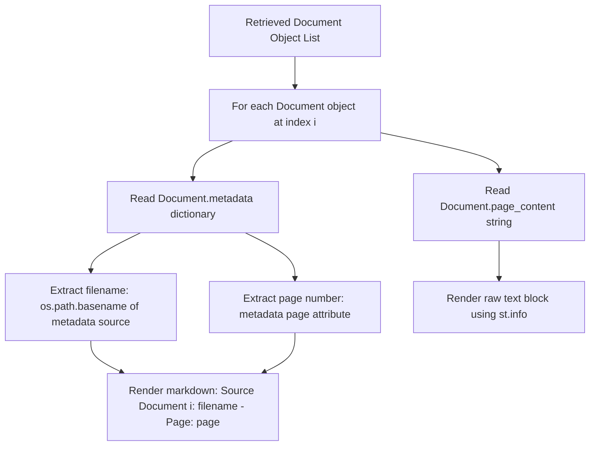

# System Architecture & Technical Specifications: Smart Academic Assistant

This document provides an exhaustive, production-grade technical specification and architectural decomposition of the **Smart Academic Assistant** (Hybrid RAG + Deep Learning Classifier Framework), derived directly from the source code.

---

## 1. Complete Project Architecture

The application is structured as a hybrid framework that executes two parallel pipelines when processing user queries:
1. **Deep Learning Intent/Category Classifier Pipeline**: An LSTM-based text classifier built with TensorFlow/Keras that categorizes user queries into one of four academic disciplines.
2. **Retrieval-Augmented Generation (RAG) Pipeline**: A local document retrieval and synthesis framework built on LangChain, using ChromaDB as the vector store and Ollama (Llama 3 and Nomic-Embed-Text) for semantic embeddings and response generation.

### High-Level Architectural Diagram


---

## 2. End-to-End Execution Pipeline

The life cycle of a query request flows chronologically through the following execution phases:

1. **System Initialization**:
   - Streamlit launches and reads configurations.
   - Resource managers verify the presence of `academic_classifier_model.h5` and `tokenizer.pickle`.
   - The resources are cached in system memory via `@st.cache_resource` inside [app.py](file:///c:/Users/Admin/Desktop/Smart_Academic_Assistant/app.py#L35-L50).
2. **User Query Input**:
   - The user inputs a text query or a manuscript abstract in the main text box.
3. **Intent Classification (Path A)**:
   - The query string is tokenized and padded to a fixed sequence length of 200.
   - The classifier model calculates class probabilities via its softmax output layer.
   - The domain with the highest probability is determined, and metrics are rendered.
4. **Context Retrieval & Contextual Synthesis (Path B)**:
   - If the vector database is initialized, it is queried to retrieve the top 4 most semantically similar text chunks.
   - The retrieved document contexts are combined into a system prompt.
   - The Llama 3 model processes the query and prompt to generate an authoritative response.
   - Page references and source file metadata are parsed and displayed along with the generated text.

---

## 3. Data Flow

Data inside this system progresses through discrete representations across two distinct workflows: the ETL training/ingestion stage and the real-time inference/generation stage.



---

## 4. Training Pipeline

The training pipeline is isolated in [train_model.py](file:///c:/Users/Admin/Desktop/Smart_Academic_Assistant/train_model.py) and executes offline.

### Step 1: Raw Data Ingestion
- Reads the first 40,000 JSON lines from the massive `data/arxiv-metadata-oai-snapshot.json` dataset.
- Filters out non-essential keys, keeping only the `'abstract'` and `'categories'` attributes.

### Step 2: Categorical Preprocessing
- Extracts the main high-level category (e.g. `cs` from `cs.LG` or `physics` from `physics.optics`) using the logic:
  ```python
  df['main_category'] = df['categories'].apply(lambda x: x.split()[0].split('.')[0])
  ```
- Subsets the dataset to contain only the four target academic categories: `['cs', 'math', 'physics', 'astro-ph']`.
- Maps text categories to integers:
  - `cs` $\rightarrow$ `0`
  - `math` $\rightarrow$ `1`
  - `physics` $\rightarrow$ `2`
  - `astro-ph` $\rightarrow$ `3`

### Step 3: Text Splitting & Tokenization
- Conducts a stratified 80-20 train-test split:
  ```python
  X_train, X_test, y_train, y_test = train_test_split(
      df['abstract'], df['label'], test_size=0.2, random_state=42, stratify=df['label']
  )
  ```
- Instantiates a Keras `Tokenizer` with a vocabulary limit of 15,000 words and an out-of-vocabulary token `<OOV>`.
- Converts train and test text abstracts into integer index sequences, padded or truncated to a post-padded length of 200:
  ```python
  X_train_padded = pad_sequences(X_train_seq, maxlen=200, padding='post', truncating='post')
  ```

### Step 4: Model Architecture & Compilation
The model uses a sequential layer stacking:
- **Embedding Layer**: Projects the 15,000 vocab inputs into a 64-dimensional dense space.
- **LSTM Layer 1**: 64 units, returns the full hidden sequence to feed the next layer (`return_sequences=True`).
- **Dropout (0.3)**: Regularization to prevent overfitting by deactivating 30% of connections.
- **LSTM Layer 2**: 32 units, outputs only the final hidden state vector.
- **Dense Layer (32 units)**: Hidden fully connected layer with a ReLU activation function.
- **Dropout (0.2)**: Regularization layer with a 20% dropout rate.
- **Output Dense Layer**: 4 units corresponding to the 4 categories, utilizing a Softmax activation function to generate probability distributions.

The model compiles with the Adam optimizer, Sparse Categorical Crossentropy loss function, and tracks the Accuracy metric.

### Step 5: Serialization
- Saves the trained TensorFlow model weights and graph to `academic_classifier_model.h5`.
- Serializes the trained tokenizer object as a pickle file `tokenizer.pickle`.

---

## 5. Inference Pipeline

The Deep Learning inference pipeline operates in real-time inside [app.py](file:///c:/Users/Admin/Desktop/Smart_Academic_Assistant/app.py#L110-L123):

```python
sequence = tokenizer.texts_to_sequences([user_query])
padded_sequence = pad_sequences(sequence, maxlen=200, padding='post', truncating='post')

prediction = dl_model.predict(padded_sequence)
predicted_class = TOP_CATEGORIES[np.argmax(prediction)]
confidence_score = np.max(prediction) * 100
```

1. **Input Transformation**: Accepts the raw user string and transforms it into index lists using the pre-loaded Tokenizer.
2. **Dimension Standardization**: Pads/truncates the sequence to the strict training input size of 200.
3. **Feed-Forward Forward Pass**: Passes the input array through the loaded LSTM networks.
4. **Post-Processing**: Uses `np.argmax()` to locate the index of the highest class probability in the softmax output vector and maps it back to its string name in `TOP_CATEGORIES`.

---

## 6. RAG Pipeline

The RAG pipeline retrieves localized context and augments generation:

- **Loader**: `PyPDFDirectoryLoader` parses local PDF files inside `papers_to_chat/`.
- **Text Splitter**: `RecursiveCharacterTextSplitter` segments pages into chunks of 800 characters with an overlap of 120 characters to maintain context.
- **Vector DB Storage**: Integrates with a local Chroma storage system.
- **Context Injection**: Embeds retrieved chunks as a structured string under the prompt variable `{context}`.
- **Chain Integration**: Leverages LangChain wrappers:
  - `create_stuff_documents_chain`: Directs formatting of all retrieved chunks into the prompt.
  - `create_retrieval_chain`: Combines the retriever interface with the document formatting chain.

---

## 7. Streamlit Application Workflow

The application implements a responsive Streamlit UI layout. Below is the interactive visual state logic:



- **Sidebar Control Panel**: Houses details regarding infrastructure specs and the "🔄 Execute Ingestion Pipeline" control button.
- **Status Indicators**: Uses `st.spinner()` during document digestion and vector computation. Displays error/warning calls if dependencies are offline.

---

## 8. Folder Responsibilities

The file structure dictates explicit runtime boundaries:

| Directory/File | Role & Domain Scope |
| :--- | :--- |
| **`Data/`** | Repository for large metadata source snapshots (e.g. `arxiv-metadata-oai-snapshot.json` used for classifier training). |
| **`papers_to_chat/`** | The ingestion directory containing domain-specific academic PDF manuscripts (e.g., Attention, BERT, CLIP, RAG papers). |
| **`chroma_db/`** | Directory holding the database engine files (`chroma.sqlite3`) and the indexed document chunks. |
| **`app.py`** | The core application launcher containing the Streamlit UI components, DL inference mapping, and the RAG logic. |
| **`train_model.py`** | Offline Python script for training the sequence classification neural network. |
| **`requirements.txt`** | Tracks required software library versions. |
| **`academic_classifier_model.h5`** | The compiled Keras model containing trained weights and the network graph. |
| **`tokenizer.pickle`** | Serialized tokenizer containing word-to-integer mapping indices. |

---

## 9. External Libraries and Their Roles

The system is built on these primary external dependencies:

- **`streamlit`**: Manages web rendering and interactive dashboard layouts.
- **`pandas` & `numpy`**: Perform fast vectorized label mapping, index computations, array operations, and data frame manipulation.
- **`scikit-learn`**: Handles split stratifications (`train_test_split`) for dataset balance.
- **`tensorflow` / `keras`**: powers the deep learning classifier (embeddings, recurrent LSTM networks, softmax dense computation).
- **`langchain` / `langchain-community` / `langchain-core` / `langchain-chroma`**: Orchestrates documents, loaders, prompt abstractions, and retrieval chains.
- **`chromadb`**: Operates the localized embed-retrieval index database.
- **`pypdf`**: Extract text from ingested academic PDF files.

---

## 10. Model Loading Process

Resource serialization and initialization operate in memory-restricted steps inside `app.py`:



- `@st.cache_resource` ensures that heavy file loads (such as TensorFlow networks and Pickle tokenizers) are executed only once on startup.
- The `OllamaEmbeddings` client binds to `http://127.0.0.1:11434`, referencing the `nomic-embed-text` model.
- The generative model interfaces with the local server to access the `llama3` parameters.

---

## 11. Vector Database Lifecycle

ChromaDB operates locally:

1. **Initialization**: On application load, the script searches for the directory `./chroma_db`. If found and not empty, it connects to Chroma:
   ```python
   vector_db = Chroma(persist_directory=DB_DIR, embedding_function=embeddings)
   ```
2. **Ingestion Execution**: When the ingestion pipeline button is clicked:
   - A `PyPDFDirectoryLoader` scans `papers_to_chat/` for PDFs.
   - Text chunks are generated by the splitter.
   - Chunks are vectorized and written to the SQLite backend database inside `chroma_db/`.
3. **Inference Access**: On user query submission, the connection is read-accessed to locate semantically similar vectors.

---

## 12. Embedding Generation Process

Vector embeddings are generated using the local Ollama instance:

- **Text Processing**: Ingested text is divided into chunks using the following parameters:
  - `chunk_size = 800` (aims to capture dense, standalone technical ideas).
  - `chunk_overlap = 120` (prevents contextual loss along split boundaries).
- **Vector Conversion**: The chunked text blocks are passed to the `OllamaEmbeddings` client, which calls the `nomic-embed-text` model.
- **Index Storage**: The returned vector representations are indexed and stored in Chroma DB.

---

## 13. Retrieval Process

The retrieval process identifies relevant context for generation:

```python
retriever_node = vector_db.as_retriever(search_kwargs={"k": 4})
```

- **Query Mapping**: The user query is mapped into the embedding space using `nomic-embed-text`.
- **Similarity Search**: ChromaDB performs a vector similarity search using L2 distance/cosine metric comparisons.
- **Context Output**: The system retrieves the top 4 matching document chunks (`k=4`) and extracts their raw text and metadata (including file origin path and page location).

---

## 14. Prompt Construction

The retrieved text is integrated into the final prompt to ground the model:

### System Prompt Template
```
You are a highly analytical academic research assistant. Formulate an authoritative, objective reply based strictly on the provided context. Maintain academic integrity. If the answer cannot be confidently inferred from the retrieved data, explicitly respond with: 'The requested information is not available within the ingested references.' and do not extrapolate or hallucinate.

Retrieved References Context:
{context}
```

### Human Input Template
```
{input}
```

- `{context}`: Injected with the text from the top 4 retrieved PDF chunks.
- `{input}`: Injected with the raw user query.

---

## 15. LLM Generation Process

The response generation process flows as follows:

- **Input Dispatch**: The constructed prompt is sent to the local Ollama instance running `llama3`.
- **Strict Temperature Control**: The temperature parameter is set to `0.1` (`Ollama(model="llama3", temperature=0.1)`) to minimize random variations and encourage deterministic, fact-grounded outputs.
- **Response Synthesis**: Llama 3 processes the retrieved documents to answer the user query while adhering to the instructions not to extrapolate or hallucinate.

---

## 16. Source Citation Flow

The system extracts and displays page-level source citations alongside generated answers:



- The code reads document metadata attributes, such as `source` (file path) and `page` (PDF page index).
- It extracts the filename using `os.path.basename()` and formats the page reference.
- The raw source text chunk is displayed inside a Streamlit expander (`st.expander`) using `st.info()` for verification.

---

## 17. Error Handling Strategy

The system implements error handling to manage failures:

1. **Pre-startup Check**: It checks for the existence of required models and tokenizer files before loading. If missing, it calls `st.stop()` and displays an error message:
   ```python
   st.error(f"Critical System Failure: Execution assets '{MODEL_PATH}' or '{TOKENIZER_PATH}' are missing. Run 'train_model.py' first.")
   ```
2. **Ingestion Directory Check**: If the PDF directory loader returns no documents, it stops processing and flags the issue:
   ```python
   if not documents:
       st.sidebar.error(f"Ingestion directory '{PAPERS_DIR}' contains zero documents.")
       return None
   ```
3. **Database Check**: If the database directory `chroma_db` is missing or empty, the RAG query pipeline is bypassed, and a status message is shown in the UI.
4. **Hallucination Prevention**: The system prompt instructs the LLM to reply with a default message if the answer cannot be found in the retrieved documents:
   ```
   If the answer cannot be confidently inferred from the retrieved data, explicitly respond with: 'The requested information is not available within the ingested references.' and do not extrapolate or hallucinate.
   ```

---

## 18. Deployment Workflow

Deploying and running the application locally involves the following steps:

1. **Install Dependencies**:
   Install required packages via `pip`:
   ```bash
   pip install -r requirements.txt
   ```
2. **Local Model Setup**:
   Ensure Ollama is installed and running locally on port `11434`, and download the required models:
   ```bash
   ollama pull llama3
   ollama pull nomic-embed-text
   ```
3. **Train Classifier Model**:
   Download the arXiv metadata snapshot to `data/arxiv-metadata-oai-snapshot.json` and train the classifier:
   ```bash
   python train_model.py
   ```
   This generates `academic_classifier_model.h5` and `tokenizer.pickle` in the root folder.
4. **Launch Streamlit Web App**:
   Start the web interface using the following command:
   ```bash
   streamlit run app.py
   ```
5. **Populate Ingestion Folder**:
   Add academic research PDF files to the `papers_to_chat/` directory.
6. **Initialize Database**:
   Open the Streamlit interface in your browser, and click **"Execute Ingestion Pipeline"** to index your documents and initialize the RAG assistant.
