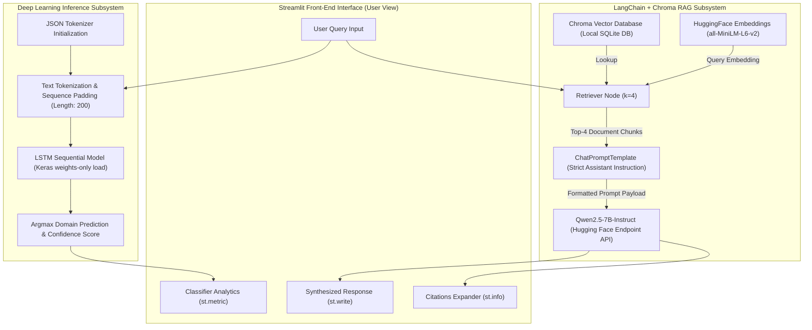
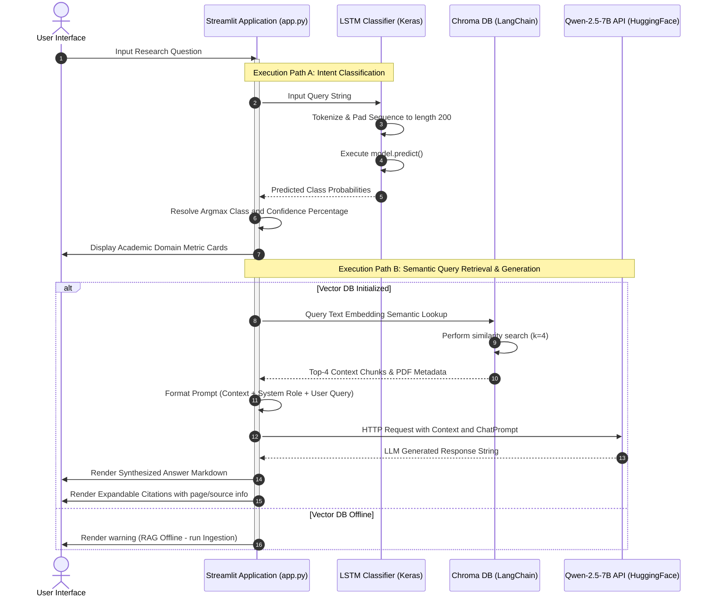
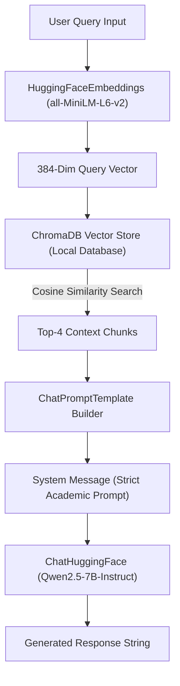
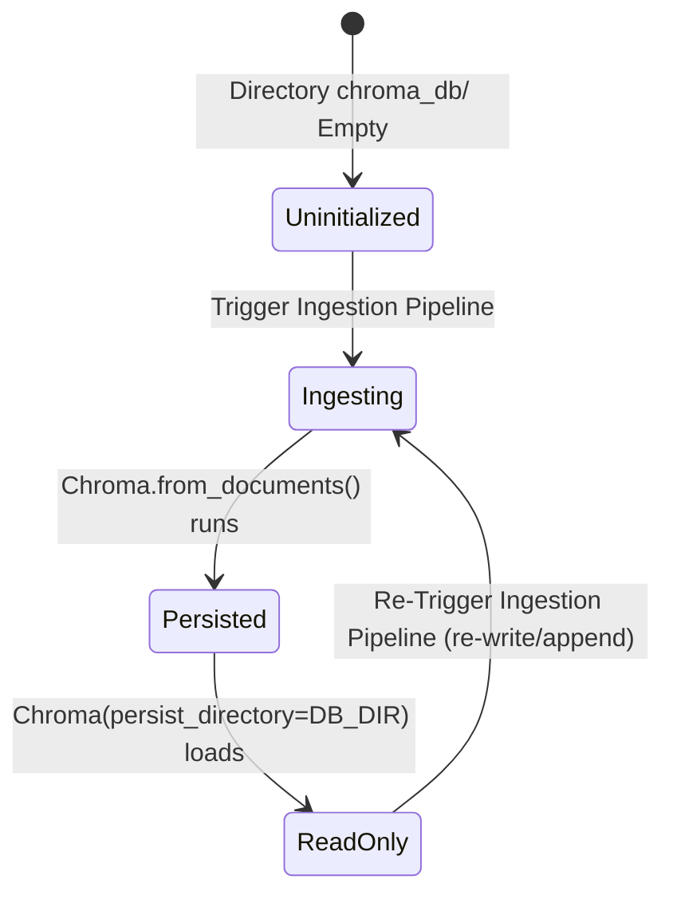
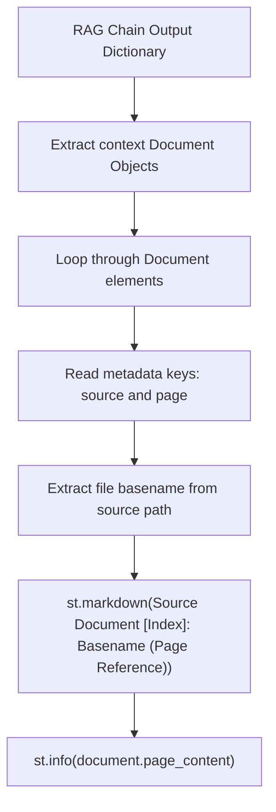
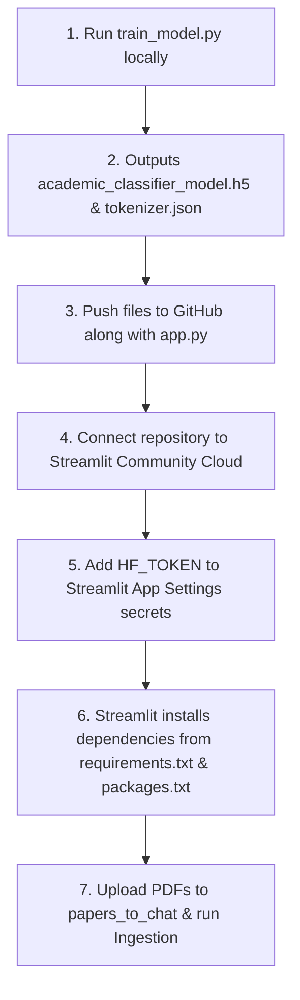

# Smart Academic Research Assistant: Technical Architecture & Pipeline Documentation

This document provides a comprehensive, professional-grade architectural overview and system analysis of the Hybrid Deep Learning Intent Classifier and Local Retrieval-Augmented Generation (RAG) Framework. The analysis is derived directly from the codebase of the [ayamustafa-png/RAG-System](https://github.com/ayamustafa-png/RAG-System) repository.

---

## 1. System Architecture Diagram

The system operates as a hybrid architecture consisting of two isolated pipelines operating over a unified interface: a local **Deep Learning (DL) sequence classifier** and a **Semantic Retrieval-Augmented Generation (RAG) loop**.



---

## 2. End-to-End Execution Pipeline

The execution sequence within the application is triggered by two events: the system initialization/bootstrapping phase and the query-processing phase.

### A. Bootstrapping & Resource Initialization Phase
1. **SQLite3 Library Override**: Streamlit Community Cloud often features older SQLite binary installations incompatible with Chroma DB requirements. The system injects a workaround to dynamically replace the default `sqlite3` reference with the `pysqlite3` library if available:
   ```python
   try:
       __import__("pysqlite3")
       sys.modules["sqlite3"] = sys.modules.pop("pysqlite3")
   except ImportError:
       pass
   ```
2. **Directory & Page Config Checks**: A target ingestion folder named `papers_to_chat` is verified and dynamically created if absent. The Streamlit screen config is set to `wide` layout.
3. **Model Resource Loading (`@st.cache_resource`)**:
   - The LSTM intent classifier is rebuilt programmatically using Keras sequential layer specifications (avoiding Keras schema issues during full-serialization calls).
   - Pre-compiled model weights are mapped from the local `academic_classifier_model.h5` file onto the initialized neural model.
   - The token indexing dictionary is loaded from `tokenizer.json` using Keras's `tokenizer_from_json` function.
   - The `HuggingFaceEmbeddings` instance initializes the local `all-MiniLM-L6-v2` transformer model.
   - An API client session is negotiated using `HuggingFaceEndpoint` to connect to `Qwen/Qwen2.5-7B-Instruct` using the Hugging Face hub API token stored in `secrets.toml`.

### B. User Query Processing Phase


---

## 3. Data Flow

Data translates across three unique representations depending on the pipeline:

### Vector Ingestion Data Flow (ETL)
* **Raw Files**: `.pdf` documents within the `papers_to_chat/` directory.
* **Document Objects**: Parsed via `PyPDFDirectoryLoader` into document structures with metadata blocks containing files' absolute path strings (`source`) and page identifiers (`page`).
* **Text Chunks**: Split via `RecursiveCharacterTextSplitter` into chunks of size 800 (overlap: 120).
* **Dense Vectors**: Derived using the `all-MiniLM-L6-v2` tokenizer and transformer, compiling text segments into 384-dimensional floating-point vectors.
* **Vector Store**: Written to the SQLite/Chroma metadata index tables inside `chroma_db/`.

### Intent Classification Data Flow
* **Raw String**: User query input.
* **Token Sequences**: List of numerical integers mapped against `tokenizer.json`'s vocabulary indexes (with OOV tokens replaced by `1`).
* **Padded Arrays**: Numpy arrays of shape `(1, 200)` containing token indexes, right-padded with `0`.
* **Classifier Outputs**: Matrix of softmax float probabilities of shape `(1, 4)` indicating classifications across `['cs', 'math', 'physics', 'astro-ph']`.

### RAG Retrieval & Prompt Construction Data Flow
* **Semantic Retrieval**: Raw query mapped to a 384-dimensional query vector $\rightarrow$ compared against chunk embeddings in ChromaDB using a similarity metric.
* **Prompt Construction**:
  ```
  [System Message] -> [Retrieved Text Context (Chunk 1 + Chunk 2 + ...)]
  [User Message]   -> [Raw User Input String]
  ```
* **Payload Transmission**: Serialized JSON payloads transferred over HTTP/HTTPS to HuggingFace Endpoint nodes.
* **Response Generation**: LLM generated tokens compiled back to UI output text alongside source citation keys parsed from document metadata.

---

## 4. Deep Learning Classifier Training Pipeline

The training pipeline resides in `train_model.py` and functions as a standalone offline script.

```mermaid
graph LR
    Dataset["data/arxiv-metadata-oai-snapshot.json"] --> ParseJSON["Parse abstract & categories"]
    ParseJSON --> Clean["Extract primary category & Filter CS/Math/Physics/Astro-ph"]
    Clean --> Split["Train-Test Split (80/20 Stratified)"]
    Split --> FitTokenizer["Fit Tokenizer (Vocab Size: 15,000)"]
    FitTokenizer --> Tokenize["Convert text to sequence & pad to 200"]
    Tokenize --> Train["Train sequential LSTM (5 epochs, batch 64)"]
    Train --> Save["Output weight model .h5 & tokenizer .json"]
```



### Steps in the Training Pipeline:
1. **Data Ingestion**: Loads the first 40,000 metadata strings from the local ArXiv snapshot JSON dataset.
2. **Label Extraction & Filtering**:
   - Extraction logic: Isolates the first category code from the metadata row (splitting by spaces and dots).
   - Filtering: Keeps instances where the extracted class matches one of the four categories: `cs`, `math`, `physics`, or `astro-ph`.
   - Mapping: Converts category keys into zero-indexed labels.
3. **Train-Test Stratified Split**: Partitions the remaining samples (80% train, 20% validation) while preserving label distribution ratios (stratified split).
4. **Tokenization Strategy**:
   - Vocabulary restricted to the top 15,000 terms.
   - Sets `<OOV>` for out-of-vocabulary terms.
   - Padded to a maximum sequence length of 200 words (`padding='post'`, `truncating='post'`).
5. **LSTM Model Neural Architecture**:
   - **Input Layer**: Shape `(200,)` representing padded sequence tokens.
   - **Embedding Layer**: Projects integer vocabulary tokens into a continuous dense space (vocabulary size: 15,000, output embedding dimensions: 64).
   - **LSTM Layer 1**: Returning sequences, consisting of 64 recurrent cells.
   - **Dropout Layer 1**: Regulates overfitting by setting 30% of inputs to zero.
   - **LSTM Layer 2**: Outputs final sequence state representation, consisting of 32 cells.
   - **Dense Layer 1 (ReLU)**: 32 hidden units with rectified linear unit activation.
   - **Dropout Layer 2**: Regulates final classification layer by setting 20% of inputs to zero.
   - **Dense Output Layer (Softmax)**: Computes class probabilities across the 4 categories.
6. **Compilation & Serialization**:
   - Compiled with Adam optimizer, sparse categorical cross-entropy loss, and validation metrics tracked on accuracy.
   - Serialized as `academic_classifier_model.h5` and `tokenizer.json`. Keras Tokenizer configurations are saved in JSON format instead of Pickles to maintain cross-system version compatibility.

---

## 5. Model Inference Pipeline

Inference executes dynamically within the Streamlit application when users submit queries:

1. **Pre-processing**:
   - The query string is tokenized against the loaded JSON tokenizer indices:
     ```python
     sequence = tokenizer.texts_to_sequences([user_query])
     ```
   - The sequence is post-padded and truncated to a length of 200 integers:
     ```python
     padded_sequence = pad_sequences(sequence, maxlen=200, padding='post', truncating='post')
     ```
2. **Model Call**:
   - Executes a forward pass:
     ```python
     prediction = dl_model.predict(padded_sequence)
     ```
3. **Class Decoding**:
   - Obtains the index of the highest probability value using `np.argmax(prediction)` and queries the index against the `TOP_CATEGORIES` list (`['cs', 'math', 'physics', 'astro-ph']`).
   - Obtains the confidence score: `np.max(prediction) * 100`.

---

## 6. RAG Pipeline

The Retrieval-Augmented Generation (RAG) system is built on LangChain. It uses a local vector index to search for documents, and uses a remote LLM API to generate answers.



---

## 7. Streamlit Application Workflow

The web interface is orchestrated by `app.py` and contains the following control flow:

* **Resource Cache Verification**: Upon launch, Streamlit calls `initialize_system_resources`. The `@st.cache_resource` decorator keeps assets in memory across user requests to avoid reload overhead.
* **Sidebar Controls**:
  - Contains instructions on uploading PDF documents to the `papers_to_chat` folder.
  - A button triggers the `execute_vector_ingestion` ETL loop.
  - Displays infrastructure details.
* **User Query Section**:
  - Offers a search box for query inputs.
  - Submitting a query triggers both the LSTM Classifier execution flow (displaying results via `st.metric`) and the RAG workflow.
  - Outputs synthesized responses and displays references in an expandable section.

---

## 8. Folder Responsibilities

* **Workspace Root (`/`)**:
  - `app.py` (Local file: [app (1).py](file:///c:/Users/Admin/Downloads/online%20copy/app%20%281%29.py)): Application entry point containing the UI framework, resource initialization routines, inference pipelines, and RAG execution paths.
  - `train_model.py` (Local file: [train_model (1).py](file:///c:/Users/Admin/Downloads/online%20copy/train_model%20%281%29.py)): Local training script containing the preprocessing, tokenization, model compilation, training, and serialization logic.
  - `tokenizer.json` (Local file: [tokenizer (1).json](file:///c:/Users/Admin/Downloads/online%20copy/tokenizer%20%281%29.json)): Holds the serialized Keras Tokenizer states.
  - `requirements.txt` (Local file: [requirements (1).txt](file:///c:/Users/Admin/Downloads/online%20copy/requirements%20%281%29.txt)): Pinpoints pip dependency specifications.
  - `packages.txt` (Local file: [packages.txt](file:///c:/Users/Admin/Downloads/online%20copy/packages.txt)): System-level dependency configurations.
  - `academic_classifier_model.h5`: The binary model weights generated from offline training.
* **`papers_to_chat/` (Local / Dynamic)**:
  - Source directory. Holds academic PDF documents to be processed by the RAG database.
* **`chroma_db/` (Local / Dynamic)**:
  - Local database storage directory containing SQLite data, vector database structures, segment indexes, and parquet mappings compiled during ingestion.

---

## 9. External Libraries and Their Roles

| Library name | Scope / Purpose | Code References |
| :--- | :--- | :--- |
| `streamlit` | User Interface, caching, and front-end rendering. | Page configurations, metrics rendering, state actions. |
| `tensorflow` / `tensorflow-cpu` | Deep learning execution, layers compilation, classifier training, and inference. | Layer definitions, Keras Sequential Model initialization, sequence preprocessing tools. |
| `scikit-learn` | Machine learning datasets preprocessing. | `train_test_split` for stratified validation splits. |
| `pandas` | Training data manipulations. | Loading JSON lines, extracting primary categories, and cleaning labels. |
| `numpy` | High-performance array operations. | Argmax evaluations and array formatting. |
| `langchain_community` | Community extensions for document handling. | `PyPDFDirectoryLoader` parsing local PDFs. |
| `langchain_text_splitters` | Text segment handling. | `RecursiveCharacterTextSplitter` splitting documents. |
| `langchain_chroma` | LangChain's vector database integrations. | `Chroma` document storage and semantic retriever wrapper initialization. |
| `langchain_huggingface` | Interfaces to Hugging Face embedding engines and LLMs. | `HuggingFaceEmbeddings` for vector math, `HuggingFaceEndpoint`/`ChatHuggingFace` for generative models. |
| `langchain_core` | Core runtime abstractions. | `ChatPromptTemplate` constructions. |
| `pysqlite3-binary` | Database dependency workarounds. | Injected overrides mapping `sqlite3` to `pysqlite3` to support newer database versions. |
| `pypdf` | Core PDF parser. | Internal utility invoked by `PyPDFDirectoryLoader` to parse layout text from binary files. |

---

## 10. Model Loading Process

### A. Deep Learning Sequential Classifier
The classifier is loaded by reconstructing the exact neural layer sequence before loading weights:
1. Rebuild the `Sequential` model:
   ```python
   tf.keras.Sequential([
       tf.keras.Input(shape=(MAX_SEQUENCE_LENGTH,)),
       tf.keras.layers.Embedding(VOCAB_SIZE, EMBEDDING_DIM),
       tf.keras.layers.LSTM(64, return_sequences=True),
       tf.keras.layers.Dropout(0.3),
       tf.keras.layers.LSTM(32),
       tf.keras.layers.Dense(32, activation='relu'),
       tf.keras.layers.Dropout(0.2),
       tf.keras.layers.Dense(len(TOP_CATEGORIES), activation='softmax')
   ])
   ```
2. Map the weight arrays from `academic_classifier_model.h5` into the model:
   ```python
   dl_model.load_weights(model_file)
   ```
This weights-only strategy prevents model-loading issues due to minor config schema changes across different Keras versions.

### B. HuggingFace Embeddings
Loads sentence-transformer parameters into memory locally:
```python
embedding_client = HuggingFaceEmbeddings(model_name="all-MiniLM-L6-v2")
```

### C. ChatHuggingFace / Generative LLM
Establishes a connection to the Hugging Face API using the app's secret token:
```python
llm_endpoint = HuggingFaceEndpoint(
    repo_id="Qwen/Qwen2.5-7B-Instruct",
    task="conversational",
    provider="auto",
    temperature=0.1,
    max_new_tokens=512,
    huggingfacehub_api_token=hf_token
)
llm_node = ChatHuggingFace(llm=llm_endpoint)
```

---

## 11. Vector Database Lifecycle



* **Creation & Formatting**: Triggered when users request an ETL run. Parses PDFs, splits them into chunk segments, embeds the texts, and saves them to SQLite indexes inside `chroma_db/`.
* **Runtime Read-only Loading**: During app initialization, if the `chroma_db/` directory contains files, Chroma is loaded as a read-only database instance:
  ```python
  if os.path.exists(DB_DIR) and len(os.listdir(DB_DIR)) > 0:
      vector_db = Chroma(persist_directory=DB_DIR, embedding_function=embeddings)
  ```
* **Disposal & Release**: Resources are garbage collected when the Streamlit server thread shuts down.

---

## 12. Embedding Generation Process

1. **Model Specs**: Uses `all-MiniLM-L6-v2`. This maps strings into dense vectors in a 384-dimensional space.
2. **Processing Documents**: During ingestion, text chunks are passed to `HuggingFaceEmbeddings` which runs a local transformer to convert sentences into vector coordinates representing semantic concepts.
3. **Processing Queries**: When users submit queries, the text is embedded into a 384-dimensional query vector using the same model to ensure consistent distance measurements during search.

---

## 13. Retrieval Process

* **Configuration**: Chroma is initialized as a retriever to search for relevant context using `search_kwargs={"k": 4}`.
* **Process**:
  1. The query text is embedded into a vector.
  2. The system compares the query vector against document vectors using a distance metric (e.g. Cosine similarity).
  3. Returns the 4 closest document chunks containing matching semantic context.
  4. Keeps track of source metadata details (`source` and `page`) for citations.

---

## 14. Prompt Construction

Prompts are constructed using LangChain's `ChatPromptTemplate` which maps a role-based structure:

```python
system_instructions = (
    "You are a highly analytical academic research assistant. Formulate an authoritative, objective reply "
    "based strictly on the provided context. Maintain academic integrity. If the answer cannot be confidently "
    "inferred from the retrieved data, explicitly respond with: 'The requested information is not available "
    "within the ingested references.' and do not extrapolate or hallucinate.\n\n"
    "Retrieved References Context:\n{context}"
)
prompt_template = ChatPromptTemplate.from_messages([
    ("system", system_instructions),
    ("human", "{input}"),
])
```

- `{context}`: The system joins the page contents of the 4 retrieved document chunks into a single text block.
- `{input}`: The system inputs the raw user query string.

---

## 15. LLM Generation Process

* **Model Endpoint**: Connects to the open-weights model `Qwen/Qwen2.5-7B-Instruct` via Hugging Face server-side Inference Providers.
* **Parameters**:
  - `temperature = 0.1`: Ensures factual, consistent, and deterministic answers.
  - `max_new_tokens = 512`: Restricts answer lengths to prevent unnecessary processing costs.
  - `task = "conversational"` & `provider = "auto"`.
* **Execution**: LangChain combines the prompt structure and routes it to the remote API. The endpoint runs text generation and returns the completed text response.

---

## 16. Source Citation Flow

The system outputs citations to show exactly where retrieved information came from:



- Source Basename Resolution:
  ```python
  file_origin = os.path.basename(document.metadata.get("source", "Unknown_Reference.pdf"))
  ```
- Page Page Resolution:
  ```python
  page_location = document.metadata.get("page", "N/A")
  ```

---

## 17. Error Handling Strategy

The system handles potential runtime issues using the following patterns:

* **Missing SQLite Compatibility (pysqlite3 override)**: Catches imports failures when testing or running on environments without modern SQLite installations.
* **Dataset Verification**: The training script verifies that `data/arxiv-metadata-oai-snapshot.json` exists before running:
  ```python
  if not os.path.exists(DATA_PATH):
      raise FileNotFoundError(f"Dataset not found at execution path: {DATA_PATH}")
  ```
* **Offline Model Verification**: The application verifies that the Keras weights and tokenizer are present before starting. If missing, it halts execution to prevent runtime crashes:
  ```python
  if os.path.exists(MODEL_PATH) and os.path.exists(TOKENIZER_PATH):
      dl_model, tokenizer, embeddings, llm = initialize_system_resources()
  else:
      st.error("الملفين ... مش موجودين في الريبو. شغّلي train_model.py الأول عندك...")
      st.stop()
  ```
* **API Key Configuration Safeguards**: Verifies the HuggingFace token exists in Streamlit's secrets:
  ```python
  hf_token = st.secrets.get("HF_TOKEN")
  if not hf_token:
      st.error("HF_TOKEN مش موجود في الـ Secrets بتاعة التطبيق...")
      st.stop()
  ```
* **Ingestion Guardrails**: Displays an error in the sidebar if users attempt to index an empty directory.
* **LLM Call Exceptions**: Wraps LLM requests in try-except blocks. If a call fails (e.g. if the model is deprecated or the API is down), the app displays the error and suggests alternative models:
  ```python
  except Exception as e:
      st.error(f"حصل خطأ أثناء توليد الإجابة من الـ LLM: {e}")
  ```
* **Offline Vector Database State**: Displays a warning if no vector database is detected in `chroma_db`, instructing the user to run the ingestion pipeline.

---

## 18. Deployment Workflow



1. **Step 1: Offline Training**: Run `train_model.py` locally to process the ArXiv snapshot data and output `academic_classifier_model.h5` and `tokenizer.json`.
2. **Step 2: Version Control Push**: Push the trained model weights, tokenizer configs, `requirements.txt`, and system packages files to the GitHub repository.
3. **Step 3: Connect Streamlit Cloud**: Link the GitHub repository to Streamlit Community Cloud and set the target entry point file to `app.py`.
4. **Step 4: Secrets Setup**: Configure secrets on Streamlit App Settings:
   ```toml
   HF_TOKEN = "hf_xxxxxxxxxxxxxxxxxxxxxxxx"
   ```
5. **Step 5: Automated Installation**: Streamlit Cloud builds the container image, installs system libraries listed in `packages.txt` (like `build-essential` via apt), and installs python libraries listed in `requirements.txt` via pip.
6. **Step 6: UI Setup**: Upload academic PDFs to `papers_to_chat/` and click the "Execute Ingestion Pipeline" button to build the vector index.
